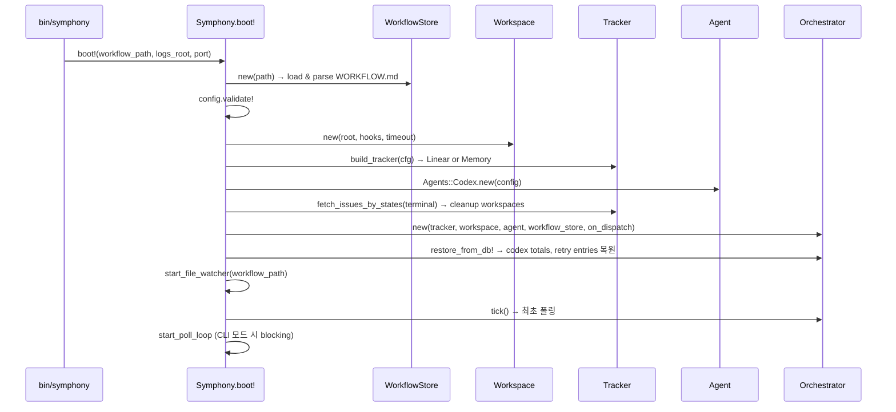
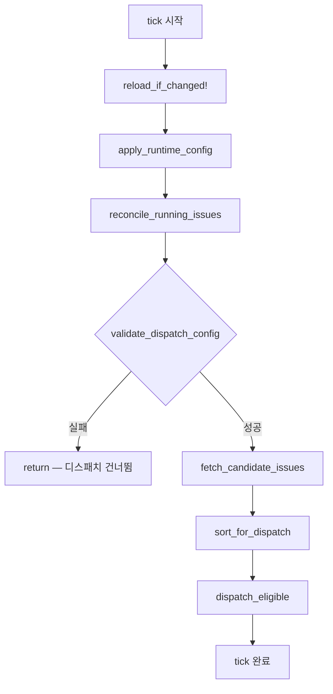
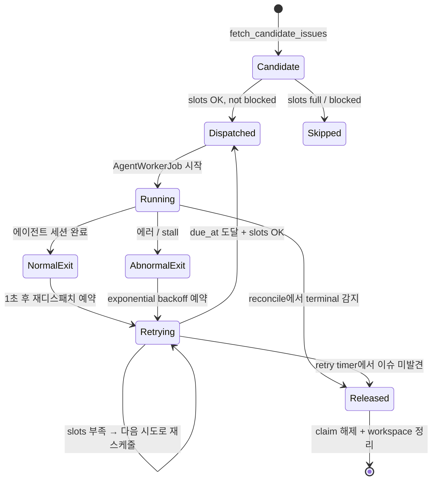
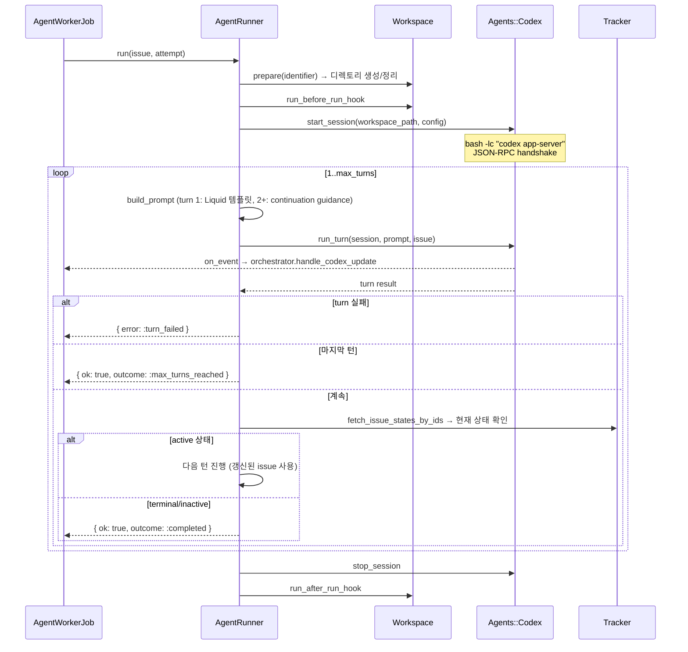
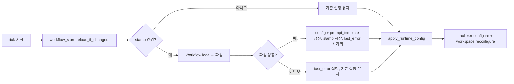

# Symphony 기능 동작 레퍼런스

각 계층이 내부에서 어떻게 동작하는지를 다룬다.
설정 방법과 사용법은 [운영 가이드](operator-guide.md)를 참고한다.

---

## 1. 부트 시퀀스

`bin/symphony` → `Symphony.boot!` 호출로 시작된다.



단계별 상세:

1. **WorkflowStore 초기화** — YAML front matter 파싱 + Liquid 템플릿 분리, stamp 기록
2. **설정 검증** — `tracker.kind`, `api_key`, `project_slug` 등 필수값 확인
3. **컴포넌트 초기화** — Workspace, Tracker, Agent 각각 생성
4. **Terminal 워크스페이스 정리** — 이미 종료된 이슈의 디렉토리 삭제
5. **Orchestrator 생성** — `on_dispatch` 콜백으로 `AgentWorkerJob.perform_later` 연결
6. **DB 복원** — `OrchestratorState`에서 누적 토큰, `RetryEntry`에서 재시도 큐, 중단된 `RunAttempt`은 `interrupted`로 마킹
7. **파일 감시 시작** — `Listen` gem으로 WORKFLOW.md 변경 감지
8. **최초 tick** — 즉시 한 번 폴링+디스패치
9. **폴 루프 진입** — CLI 모드에서만 blocking loop

ref: `app/models/symphony.rb`

---

## 2. 오케스트레이션 루프

### tick() 사이클

매 폴링 주기마다 `Orchestrator#tick`이 실행된다. Mutex로 직렬화된다.



**reload_if_changed!** — WorkflowStore stamp 비교, 변경 시 YAML 재파싱

**apply_runtime_config** — tracker(api_key, endpoint, slug)와 workspace(root, hooks) 핫 리로드

**reconcile_running_issues** — 아래 2단계:
- Part A: Stall 감지 — `(now - last_event_time) > stall_timeout_ms`이면 SIGTERM + 재시도
- Part B: Tracker 동기화 — 실행 중 이슈의 현재 상태를 조회하여 terminal이면 제거+정리, active면 유지

**validate_dispatch_config** — WorkflowStore 에러 또는 설정 validation 실패 시 디스패치 차단

**fetch → sort → dispatch**:
1. active_states에 해당하는 이슈 목록 조회
2. `[priority, created_at, identifier]` 순 정렬
3. 슬롯 여유 + 미claim + 비차단 이슈만 디스패치

ref: `app/models/symphony/orchestrator.rb:26-41`

### 동시성 제어

디스패치 적격 판단 순서:

```
global_slots_available?        → running.size < max_concurrent_agents
  ↓ yes
dispatch_slots_available?(st)  → state별 running 수 < per-state limit
  ↓ yes
!claimed?(issue.id)            → 이미 실행/재시도 중이 아님
  ↓ yes
!blocked_todo?(issue)          → Todo 상태 + non-terminal blocker가 없음
  ↓ yes
→ do_dispatch
```

ref: `app/models/symphony/orchestrator.rb:260-268`

---

## 3. 이슈 상태 머신

Symphony 관점의 이슈 라이프사이클:



**핵심 전이 조건**:

| 전이 | 조건 |
|---|---|
| Candidate → Dispatched | 글로벌/상태별 슬롯 여유 + 미claimed + 비차단 |
| Running → NormalExit | `AgentRunner#run` 성공 반환 |
| Running → AbnormalExit | `AgentRunner#run` 에러 또는 stall_timeout 초과 |
| NormalExit → Retrying | 항상 (1초 지연). 이슈가 여전히 active면 재실행 |
| AbnormalExit → Retrying | 항상. backoff: `10s × 2^(attempt-1)`, max 상한 적용 |
| Retrying → Released | 트래커에서 이슈가 사라졌거나 terminal 상태 |
| Running → Released | reconcile에서 이슈 상태가 terminal로 변경됨 감지 |

ref: `app/models/symphony/orchestrator.rb:44-93`

---

## 4. 에이전트 실행 흐름

### AgentRunner 동작



ref: `app/models/symphony/agent_runner.rb`

### Codex JSON-RPC 프로토콜

세션 라이프사이클:

1. **프로세스 생성** — `bash -lc "codex app-server"`, 워크스페이스 디렉토리에서 실행
2. **핸드셰이크** — `initialize` → `initialized` → `thread/start`
3. **턴 실행** — `turn/start` → 응답 스트리밍 → `turn/completed` | `turn/failed` | `turn/cancelled`
4. **자동 승인** — `approval_policy: "never"` 시 `item/approval/request` 자동 수락
5. **세션 종료** — stdin/stdout 닫기 → `SIGTERM`

### 이벤트 스트리밍 경로

```
Codex process
  → Agents::Codex#stream_turn (JSON-RPC 읽기)
    → AgentRunner on_event callback
      → AgentWorkerJob on_event lambda
        → Orchestrator#handle_codex_update
          → @running[issue_id] 갱신 (last_event, timestamp, usage, PID)
          → persist_codex_totals (누적 토큰 DB 저장)
```

### 프롬프트 구성

| 턴 | 프롬프트 내용 |
|---|---|
| 1 | Liquid 템플릿 렌더링 (WORKFLOW.md 본문 + issue 변수) |
| 2+ | `CONTINUATION_GUIDANCE` — "이전 턴이 정상 완료, 이슈는 여전히 active, 이어서 작업" |

ref: `app/models/symphony/agents/codex.rb`, `app/models/symphony/prompt_builder.rb`

---

## 5. 재시도 & 백오프

### 정상 종료 (on_worker_exit_normal)

```
실행 시간 누적 → @running에서 제거 → persist(status: "completed")
→ schedule_retry(delay: 1000ms)
→ due_at 도달 시: 트래커에서 이슈 재조회
  → active면 재디스패치
  → terminal/미발견이면 claim 해제
```

정상 종료도 재시도하는 이유: 에이전트 턴이 완료되어도 이슈가 active 상태일 수 있다. 재조회 후 여전히 active면 새 세션을 시작한다.

### 비정상 종료 (on_worker_exit_abnormal)

```
실행 시간 누적 → @running에서 제거 → persist(status: "failed", error)
→ schedule_retry(delay: failure_backoff_ms(attempt))
```

백오프 공식: `min(10,000 × 2^(attempt-1), max_retry_backoff_ms)`

### RetryScheduler

정적 유틸리티. Orchestrator 내부에서 사용한다.

ref: `app/models/symphony/retry_scheduler.rb`

### 폴 루프에서의 재시도 처리

```ruby
# Symphony.start_poll_loop 내부
orchestrator.retry_attempts
  .select { |_, e| e[:due_at] && e[:due_at] <= now }
  .each_key { |issue_id| orchestrator.on_retry_timer(issue_id) }
```

`on_retry_timer`는 트래커에서 이슈를 다시 조회하고, 슬롯이 있으면 디스패치, 없으면 다음 attempt로 재스케줄한다.

ref: `app/models/symphony.rb:114-134`, `app/models/symphony/orchestrator.rb:66-93`

---

## 6. 영속화 계층

### DB 테이블 역할

| 테이블 | 역할 | 생명주기 |
|---|---|---|
| `symphony_issues` | 디스패치된 이슈의 비정규화 스냅샷 | dispatch 시 upsert |
| `symphony_run_attempts` | 실행 이력 (attempt별) | dispatch 시 생성, 종료 시 갱신 |
| `symphony_agent_sessions` | 에이전트 세션 메타데이터 (토큰, PID, 이벤트) | 세션 시작 시 생성, 이벤트마다 갱신 |
| `symphony_retry_entries` | 재시도 큐 (due_at 기반) | 재시도 예약 시 upsert, 디스패치/해제 시 삭제 |
| `symphony_orchestrator_states` | 누적 토큰/실행시간 (단일 행) | 이벤트마다 갱신 |

### persist/restore 시점

**persist (쓰기)**:
- `persist_dispatch` — do_dispatch 시 이슈+RunAttempt 저장
- `persist_worker_exit` — worker 종료 시 RunAttempt status/error 갱신
- `persist_retry` — 재시도 예약 시 RetryEntry upsert
- `persist_codex_totals` — 에이전트 이벤트의 usage 수신 시 OrchestratorState 갱신

**restore (읽기)** — `restore_from_db!` (부팅 시 1회):
- `OrchestratorState` → codex_totals 복원
- `RetryEntry.due` → retry_attempts 복원
- `RunAttempt(status: "running")` → `interrupted`로 마킹

ref: `app/models/symphony/orchestrator/persistable.rb`

### 설계 원칙

DB는 **복구 지점**이지 주 저장소가 아니다. 런타임 상태는 Orchestrator 인메모리(`@running`, `@claimed`, `@retry_attempts`)에서 관리하고, DB는 프로세스 재시작 시 상태 복원에만 사용한다.

---

## 7. 어댑터 확장

### Trackers::Base 인터페이스

새 트래커를 추가하려면 `Trackers::Base`를 상속하고 3개 메서드를 구현한다.

| 메서드 | 반환 | 용도 |
|---|---|---|
| `fetch_candidate_issues(active_states:)` | `{ ok:, issues: [Issue] }` | tick에서 디스패치 후보 조회 |
| `fetch_issue_states_by_ids(ids)` | `{ ok:, issues: [Issue] }` | reconcile + continuation 체크 |
| `fetch_issues_by_states(states)` | `{ ok:, issues: [Issue] }` | terminal workspace 정리 |

모든 이슈는 `Symphony::Issue` 인스턴스로 정규화해야 한다.

ref: `app/models/symphony/trackers/base.rb`

### Agents::Base 인터페이스

새 에이전트를 추가하려면 `Agents::Base`를 상속하고 3개 메서드를 구현한다.

| 메서드 | 반환 | 용도 |
|---|---|---|
| `start_session(workspace_path:, config:)` | `{ ok:, session: {} }` | 세션 초기화 |
| `run_turn(session:, prompt:, issue:, &block)` | `{ ok:, event:, usage: {} }` | 턴 실행 + 이벤트 yield |
| `stop_session(session)` | — | 세션 정리 |

`run_turn`의 블록으로 이벤트를 yield하면 Orchestrator까지 전파된다.

ref: `app/models/symphony/agents/base.rb`

### 새 어댑터 등록

`Symphony.build_tracker`에 case 분기를 추가하거나, 에이전트의 경우 `Symphony.boot!`에서 초기화 로직을 확장한다.

ref: `app/models/symphony.rb:64-77`

---

## 8. 설정 핫 리로드

### WorkflowStore stamp 메커니즘

```
stamp = [File.mtime, File.size, Zlib.crc32(content)]
```

`reload_if_changed!`가 호출될 때마다 현재 stamp와 저장된 stamp를 비교한다. 불일치하면 재파싱한다.

### 리로드 흐름



### 리로드로 영향받는 항목

| 항목 | 즉시 적용 | 비고 |
|---|---|---|
| polling.interval_ms | 다음 sleep 사이클부터 | 폴 루프에서 매번 config에서 읽음 |
| tracker 설정 | 다음 tick | `apply_runtime_config`에서 reconfigure |
| workspace 설정 | 다음 tick | `apply_runtime_config`에서 reconfigure |
| agent 동시성 설정 | 다음 디스패치 판단 시 | config에서 매번 읽음 |
| codex timeout 설정 | 다음 세션 시작 시 | 실행 중 세션에는 미적용 |
| prompt 템플릿 | 다음 턴 시작 시 | `workflow_store.prompt_template`에서 매번 읽음 |

ref: `app/models/symphony/workflow_store.rb`, `app/models/symphony/orchestrator.rb:345-363`
